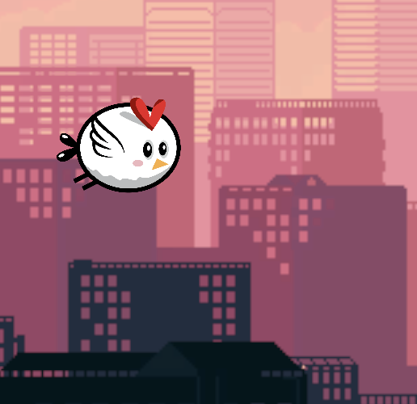
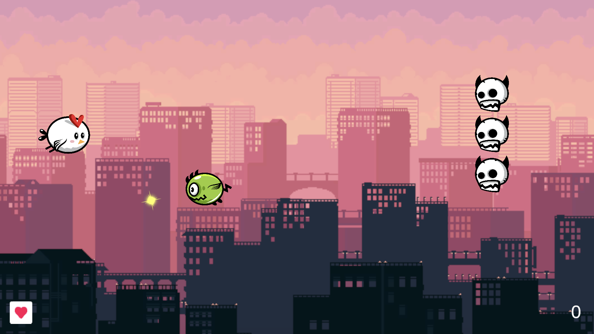
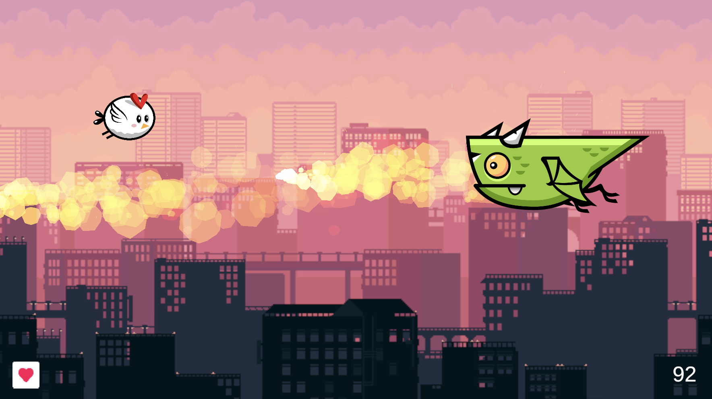
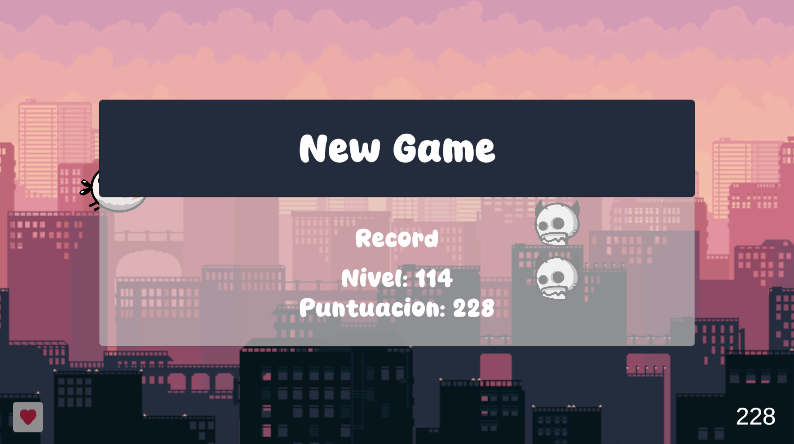

# SpaceShooterUnity

Este proyecto es una space shooter clásico de vista lateral, con fondo parallax, disparos, generación aleatoria de enemigos y jefes finales. 

Enlace itch.io https://oqubo.itch.io/spaceshooter

## Objetivo del juego

El jugador debe sobrevivir a las oleadas de enemigos, obtiene puntos al eliminarlos y recibe daño con los impactos.  

## Controles

El jugador se desplaza usando las flechas del teclado y dispara con el espacio.

## Funcionalidades implementadas

- Fondo parallax.
- Jugador. Movimiento con los ejes, comprobación para no salirse de la pantalla y disparo.
- Enemigo. Movimiento hacia la izquierda y disparo automático cada cierto tiempo.
- Punto de generación de enemigos. Genera un enemigo cada cierto tiempo y varía su posición y. 
- Colisiones.

- Interfaz
    - Indicadores del número de vidas restantes (icono con relleno radial) y de puntos (texto simple).
    - Menú de fin de partida. Un panel con el record actual y un botón para comenzar otra partida.

- Programación
    - Generación de enemigos. Oleadas de 10 enemigos y un jefe. Se seleccionan aleatoriamente de un vector de enemigos y otro de jefes. 
    - Progresión. El nivel de juego aumenta con el tiempo y afecta a la velocidad de aparición y movimiento de los enemigos (hasta un límite).
    - GameManager. Un singleton con atributos y métodos útiles declarar de forma global y con acceso único desde cualquier lugar. 
    - ObjectPool. Para los disparos del jugador.
    - PlayerPrefs. Para guardar el record.

- Animaciones
    - Animaciones idle para los enemigos.
    - Animación de idle y de golpeo para el jugador, usando animator y un trigger. 
    - Tween de parpadeo rojo para jugador y enemigos al recibir daño y de desaparición al morir.
    - Tween de movimiento, para un enemigo (que va subiendo y bajando mientras vuela a la izquierda) y para jefes finales (aparición en escena con un pequeño rebote). 

- Enemigos
    - Cada tipo tiene un valor de vida y otorga unos puntos. 
    - Tipos de enemigos: grupos de 3 calaveras a modo de muro, monstruo verde que se mueve también verticalmente y dispara, grupos de 4 moscas que protegen un power up y moscas gigantes que sueltan un power up. 
    - Jefes. Un tipo de jefe en comportamiento pero con 3 aspectos gráficos distintos. Aparecen y se quedan en una posición moviéndose en vertical y disparando. 

- Power ups
    - Aumento de velocidad de disparo. Protegido por 4 moscas.
    - Recuperación de un punto de vida. Lo “suelta” la mosca gigante al morir.
              

 
 
 